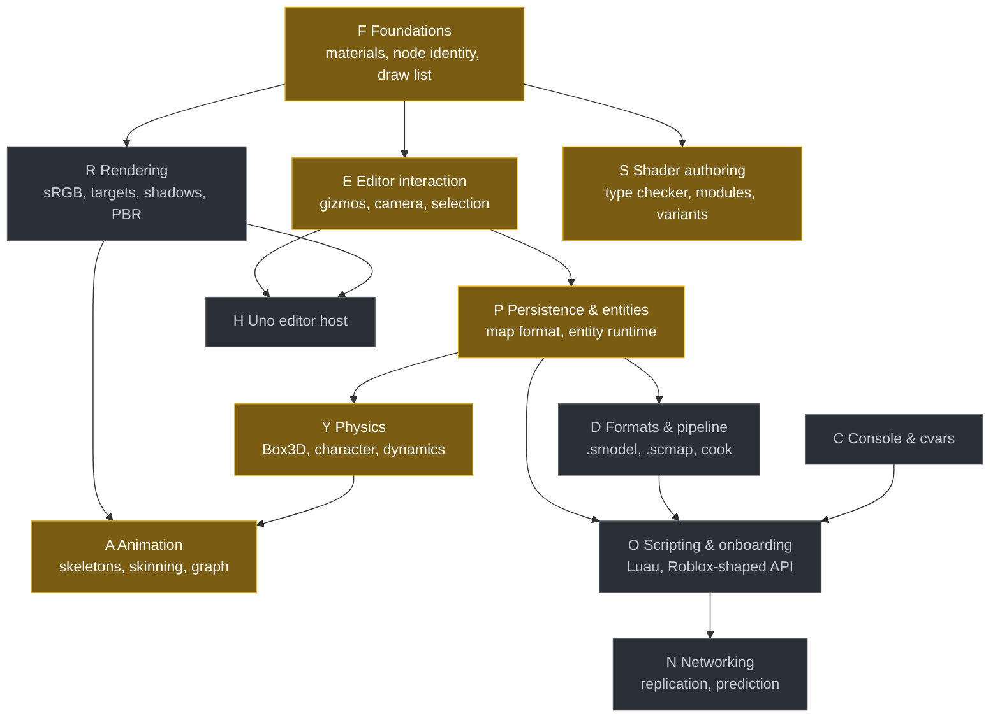
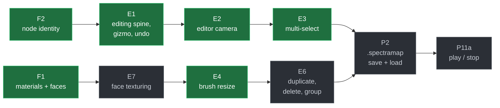

# Spectra Engine

A cross-platform game engine in C# / .NET 10, built around brush geometry and a
scene graph, with its own shader language. The goal is general purpose: anything
from an FPS to a third-person RPG to a large-scale RTS should be buildable in
it, as content and scripts rather than as engine code.

The editor takes its cues from HAMMER and Roblox Studio: you author solid world
geometry with brushes, place everything else freely in an unbounded world, and
edits recompile in the background without the world size mattering.

```bash
git submodule update --init --recursive   # Box3D, pinned
dotnet build                              # Spectra.slnx
dotnet run --project SpectraEngine.Executable -- d3d11
```

Press **F8** to drop into the character and walk around. **F7** switches
camera. **F11** toggles fullscreen. **F1** to **F6** are debug views.

---

## What works today

| Area | State |
|---|---|
| **Brush world** | CSG carve, snap, weld, per-cell BSP, chunked open world. Edits recompile incrementally in the background, at a cost independent of world size. |
| **Subtractive brushes** | Doorways and holes cut by negative brushes, unordered composition, cavity walls. |
| **Rendering** | OpenGL, D3D11 and D3D12 backends, live. Forward and wireframe pipelines over one shared draw list. |
| **Shader language** | SpectraShade compiles `.spectrashade` to GLSL and HLSL at runtime, with hot reload. LSP and a Visual Studio extension ship alongside. |
| **Editor** | Translate / rotate / resize gizmos, undo with gesture transactions, multi-select and marquee, Studio-style camera. |
| **Assets** | Textures, materials and models from real files, background decode with a render-thread upload pump, hot reload. |
| **Physics** | Box3D vendored and bound, the compiled world as static collision, a first-person character mover that walks CSG holes. |
| **Animation** | Skeletons, clips and pose blending. CPU only so far, nothing imports or draws them yet. |

Not built yet, and worth naming: skeletal mesh import and skinning on the GPU,
terrain, navmesh, particles, in-game UI, scripting, shadows, audio beyond a
stub.

---

## Roadmap

Work is organised into parallel arcs. Each arc has its own design document with
numbered milestones, risks and open decisions. The graph below is the arc-level
view; per-milestone dependencies live in the docs.



<sub>Amber: partly landed. Grey: designed, not started. No arc is complete yet.</sub>

### The critical path

The shortest sequence to an editor somebody can build a level in: place,
texture, manipulate, save, play. Everything else is deliberately off it.



### Arc status

| Arc | Document | Shipped | Next up |
|---|---|---|---|
| **F** Foundations | [ROADMAP](ROADMAP.md) | F1, F2 | F3 ViewDrawer, F4 diagnostics contract |
| **E** Editor | [ROADMAP](ROADMAP.md) | E1 to E5 | E7 face texturing, E6 structural edits |
| **P** Persistence, entities | [ROADMAP](ROADMAP.md), [data-model](docs/data-model.md) | P7a, P7b | P2 map format, P11a play/stop |
| **R** Rendering | [ROADMAP](ROADMAP.md) | none | R1 PSO key, R2 sRGB, R3 render targets |
| **S** Shader authoring | [ROADMAP](ROADMAP.md) | the language itself, GLSL, HLSL, LSP | S2 parameter scopes, S5 type checker |
| **Y** Physics | [physics](docs/physics.md) | Y0, Y1, Y2, Y3, Y5 | Y4 query unification, Y6 dynamic bodies |
| **A** Animation | this README, for now | pose primitives | import, then R5 array uniforms, then skinning |
| **D** Formats, pipeline | [formats-and-pipeline](docs/formats-and-pipeline.md) | none | D0 cook gate |
| **O** Scripting | [roblox-onboarding](docs/roblox-onboarding.md) | none | O0 Luau gate |
| **C** Console | [console](docs/console.md) | none | C0 cvar registry |
| **N** Networking | [networking](docs/networking.md) | none | N0 transport gate |
| **H** Uno host | [ROADMAP](ROADMAP.md) | none | H1 EngineHost seam |

Arc **A** is new and does not have a design document yet. Its one blocker is
worth stating: GPU skinning needs `ShaderProgram` to gain an array-uniform
overload, which is milestone **R5**, because no backend can currently set an
array of bone matrices.

---

## Repository layout

```
Assets/                      content root: textures, materials, models, shaders
SpectraEngine.Core/          the engine
  Animation/                 skeletons, clips, pose blending
  Assets/                    content root, typed caches, importers
  Bsp/                       brushes, CSG, chunked world, BSP queries
  Graphics/                  renderer abstraction, GL / D3D11 / D3D12 backends
  Input/                     backend-neutral input, cursor lock
  Physics/                   fixed tick, physics seam, character mover
  Scene/                     scene graph, camera, culling, demo scene
SpectraEngine.Editing/       editor-only: gizmos, undo, tools, selection
SpectraEngine.Executable/    demo host, wires editor and physics in
SpectraEngine.Physics.Box3D/ native binding, kept out of Core on purpose
SpectraShade.Compiler/       shader language: lexer, parser, analyser, codegen
SpectraShade.LSP/            language server
SpectraShade.VSIX/           Visual Studio extension
Test/                        xUnit v3 suites, run with dotnet run
docs/                        design documents, one per arc
native/                      Box3D submodule build
```

## Building and testing

Test projects run through `dotnet run`, not `dotnet test`, because they use
xUnit v3 on Microsoft.Testing.Platform.

```bash
dotnet run --project Test/SpectraEngine.Bsp.Tests       # CSG, BSP, scene, character, animation
dotnet run --project Test/SpectraEngine.Editing.Tests   # gizmos, undo, viewport
dotnet run --project Test/SpectraEngine.Physics.Tests   # Box3D binding, ABI guard
dotnet run --project Test/SpectraShade.Compiler.Tests   # shader compiler
dotnet run --project Test/SpectraEngine.Graphics.Tests  # GL smoke tests, needs a driver
```

The demo doubles as a smoke gate. A short run with `--selftest` must log
`Editing self-test: PASS` every few seconds with nothing at `ERR`.

```bash
dotnet run --project SpectraEngine.Executable -- d3d11 --selftest
```

Native code needs no Developer Command Prompt. CMake locates MSVC through the
registry. The one exception is the NativeAOT publish, which shells out to
`findvcvarsall.bat`. See [`native/README.md`](native/README.md).

## Design principles

The full set lives in [CLAUDE.md](CLAUDE.md). The load-bearing ones:

- **The scene graph is the spine.** Brushes are nodes. The compiled world is
  derived data, never authored.
- **Open world is first class.** No sealed levels, no PVS, no map extents. A
  brush edit costs the same at the origin and at 8,000 units out.
- **BSP is a query structure only.** Never the render path.
- **Editing lives above the engine**, in its own assembly, so gizmo and undo
  code never links into a shipped game.
- **Content is real files.** Never string literals, never byte arrays in code.
- **AOT everywhere.** No reflection-heavy patterns, no runtime codegen.
