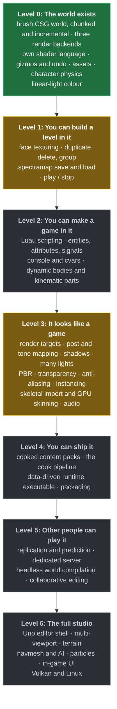
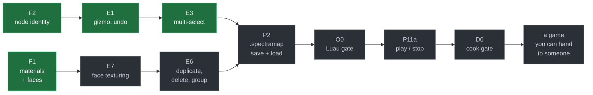

# Spectra Engine

A cross-platform game engine in C# / .NET 10, built around brush geometry and a
scene graph, with its own shader language. The goal is general purpose: anything
from an FPS to a third-person RPG to a large-scale RTS should be buildable in
it, as content and scripts rather than as engine code.

The editor takes its cues from HAMMER and Roblox Studio: you author solid world
geometry with brushes, place everything else freely in an unbounded world, and
edits recompile in the background without the world size mattering.

```bash
git submodule update --init --recursive   # Box3D, pinned
dotnet build                              # Spectra.slnx
dotnet run --project SpectraEngine.Executable -- d3d11
```

Press **F8** to drop into the character and walk around. **F7** switches
camera. **F11** toggles fullscreen. **F1** to **F6** are debug views.

---

## What works today

| Area | State |
|---|---|
| **Brush world** | CSG carve, snap, weld, per-cell BSP, chunked open world. Edits recompile incrementally in the background, at a cost independent of world size. |
| **Subtractive brushes** | Doorways and holes cut by negative brushes, unordered composition, cavity walls. |
| **Rendering** | OpenGL, D3D11 and D3D12 backends, live. Forward and wireframe pipelines over one shared draw list, through a render-pass seam that targets the window or an offscreen texture. The scene renders to a half-float target and is exposed and tone-mapped on the way out; all shading is in linear light, with sRGB decode and display encode done by the hardware. |
| **Shader language** | SpectraShade compiles `.spectrashade` to GLSL and HLSL at runtime, with hot reload. LSP and a Visual Studio extension ship alongside. |
| **Editor** | Translate / rotate / resize gizmos, undo with gesture transactions, multi-select and marquee, Studio-style camera. |
| **Assets** | Textures, materials and models from real files, background decode with a render-thread upload pump, hot reload. Materials declare whether a texture is colour or data. |
| **Physics** | Box3D vendored and bound, the compiled world as static collision, a first-person character that walks CSG holes, and one gameplay raycast that agrees with what is drawn. |
| **Animation** | Skeletons, clips and pose blending. CPU only so far, nothing imports or draws them yet. |

Not built yet, and worth naming: skeletal mesh import and skinning on the GPU,
terrain, navmesh, particles, in-game UI, scripting, shadows, audio beyond a
stub.

---

## Roadmap

Work is organised into lettered arcs that run in parallel, but the capabilities
they add are ordered, and the spine below is that order. Each level says what
the engine can do once it is reached, not what is being worked on this week:
the arcs interleave, so the rendering arc has already delivered two of level
3's prerequisites while level 1 is still open.

Per-milestone dependencies, sizes and open decisions live in the design
documents; this is the shape.



<sub>Green: landed. Amber: underway. Grey: designed, not started.</sub>

### The critical path

The shortest sequence to an engine somebody else can build and ship a game in.
Everything not on this line is deliberately off it, however much it improves
the picture.



### The dependencies that are not linear

Four real constraints cut across the spine, and they are the reason the arcs
exist at all:

- **`R3` offscreen render targets was the rendering keystone, and it has
  landed.** Shadows, post processing, anti-aliasing, material previews and the
  Uno viewport were all waiting on it; `R4` has since put the linear-to-display
  conversion in exactly one place on top of it, and the deferred G-buffer and
  its Cook-Torrance light pass on top of that, and one directional shadow
  cascade on top of that. Cascades (`R7`) are next in that chain.
- **Uncapped lights wait on blend state, which no backend has.** Deferred
  removes the reason for a light cap, but the version that actually removes it
  draws a bounding volume per light and adds the results, and today D3D11 never
  calls `OMSetBlendState`, OpenGL never enables `GL_BLEND`, and D3D12 hardcodes
  `BlendEnable = 0`. Until then the light pass carries the forward path's
  eight-light array.
- **GPU skinning waits on `R5` array uniforms, which have landed.** The
  animation arc has skeletons, clips and pose blending, all on the CPU;
  `vec4[N]` and `mat4[N]` are settable on all three backends now, so an array of
  bone matrices is no longer the blocker.
- **A dedicated server waits on headless world compilation.**
  `Scene.RebuildStaticWorld` still needs a `Renderer`, which is the next
  coupling to break before anything can simulate a world without a GPU.

### Arc status

| Arc | Document | Shipped | Next up |
|---|---|---|---|
| **F** Foundations | [ROADMAP](ROADMAP.md) | F1, F2 | F3 ViewDrawer, F4 diagnostics contract |
| **E** Editor | [ROADMAP](ROADMAP.md) | E1 to E5 | E7 face texturing, E6 structural edits |
| **P** Persistence, entities | [ROADMAP](ROADMAP.md), [data-model](docs/data-model.md) | P7a, P7b | P2 map format, P11a play/stop |
| **R** Rendering | [ROADMAP](ROADMAP.md) | R1 PSO key, R2 sRGB, R3 targets, R4 tone mapping, R5 array uniforms, R8 lights, deferred + PBR, R6 shadows | R7 cascades, blend state, IBL |
| **S** Shader authoring | [ROADMAP](ROADMAP.md) | the language itself, GLSL, HLSL, LSP | S2 parameter scopes, S5 type checker |
| **Y** Physics | [physics](docs/physics.md) | Y0 to Y5 | Y6 dynamic bodies, Y7 kinematic parts |
| **A** Animation | this README, for now | pose primitives | import, then R5, then skinning |
| **D** Formats, pipeline | [formats-and-pipeline](docs/formats-and-pipeline.md) | none | D0 cook gate |
| **O** Scripting | [roblox-onboarding](docs/roblox-onboarding.md) | none | O0 Luau gate |
| **C** Console | [console](docs/console.md) | none | C0 cvar registry |
| **N** Networking | [networking](docs/networking.md) | none | N0 transport gate |
| **H** Uno host | [ROADMAP](ROADMAP.md) | none | H1 EngineHost seam |

Arc **A** is new and has no design document yet.

---

## Repository layout

```
Assets/                      content root: textures, materials, models, shaders
SpectraEngine.Core/          the engine
  Animation/                 skeletons, clips, pose blending
  Assets/                    content root, typed caches, importers
  Bsp/                       brushes, CSG, chunked world, BSP queries
  Graphics/                  renderer abstraction, GL / D3D11 / D3D12 backends
  Input/                     backend-neutral input, cursor lock
  Physics/                   fixed tick, physics seam, character mover
  Scene/                     scene graph, camera, culling, demo scene
SpectraEngine.Editing/       editor-only: gizmos, undo, tools, selection
SpectraEngine.Executable/    demo host, wires editor and physics in
SpectraEngine.Physics.Box3D/ native binding, kept out of Core on purpose
SpectraShade.Compiler/       shader language: lexer, parser, analyser, codegen
SpectraShade.LSP/            language server
SpectraShade.VSIX/           Visual Studio extension
Test/                        xUnit v3 suites, run with dotnet run
docs/                        design documents, one per arc
native/                      Box3D submodule build
```

## Building and testing

Test projects run through `dotnet run`, not `dotnet test`, because they use
xUnit v3 on Microsoft.Testing.Platform.

```bash
dotnet run --project Test/SpectraEngine.Bsp.Tests       # CSG, BSP, scene, character, animation
dotnet run --project Test/SpectraEngine.Editing.Tests   # gizmos, undo, viewport
dotnet run --project Test/SpectraEngine.Physics.Tests   # Box3D binding, ABI guard
dotnet run --project Test/SpectraShade.Compiler.Tests   # shader compiler
dotnet run --project Test/SpectraEngine.Graphics.Tests  # GL smoke tests, needs a driver
```

The demo doubles as a smoke gate. A short run with `--selftest` must log
`Editing self-test: PASS` every few seconds with nothing at `ERR`.

```bash
dotnet run --project SpectraEngine.Executable -- d3d11 --selftest
```

Native code needs no Developer Command Prompt. CMake locates MSVC through the
registry. The one exception is the NativeAOT publish, which shells out to
`findvcvarsall.bat`. See [`native/README.md`](native/README.md).

## Design principles

The full set lives in [CLAUDE.md](CLAUDE.md). The load-bearing ones:

- **The scene graph is the spine.** Brushes are nodes. The compiled world is
  derived data, never authored.
- **Open world is first class.** No sealed levels, no PVS, no map extents. A
  brush edit costs the same at the origin and at 8,000 units out.
- **BSP is a query structure only.** Never the render path.
- **Editing lives above the engine**, in its own assembly, so gizmo and undo
  code never links into a shipped game.
- **Content is real files.** Never string literals, never byte arrays in code.
- **AOT everywhere.** No reflection-heavy patterns, no runtime codegen.
